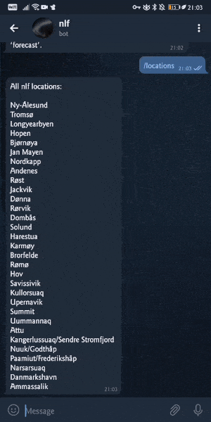
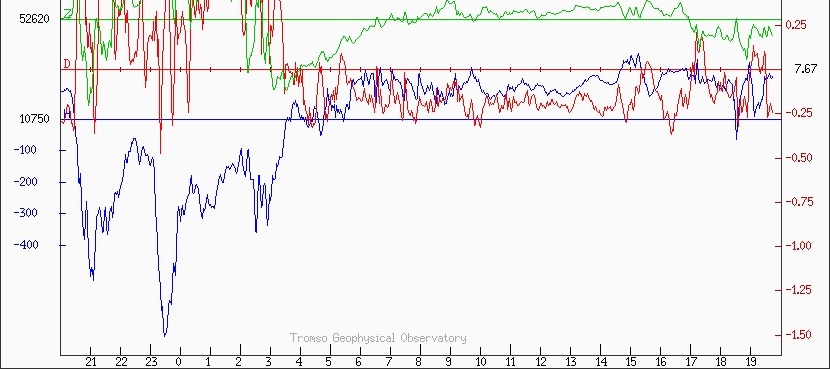
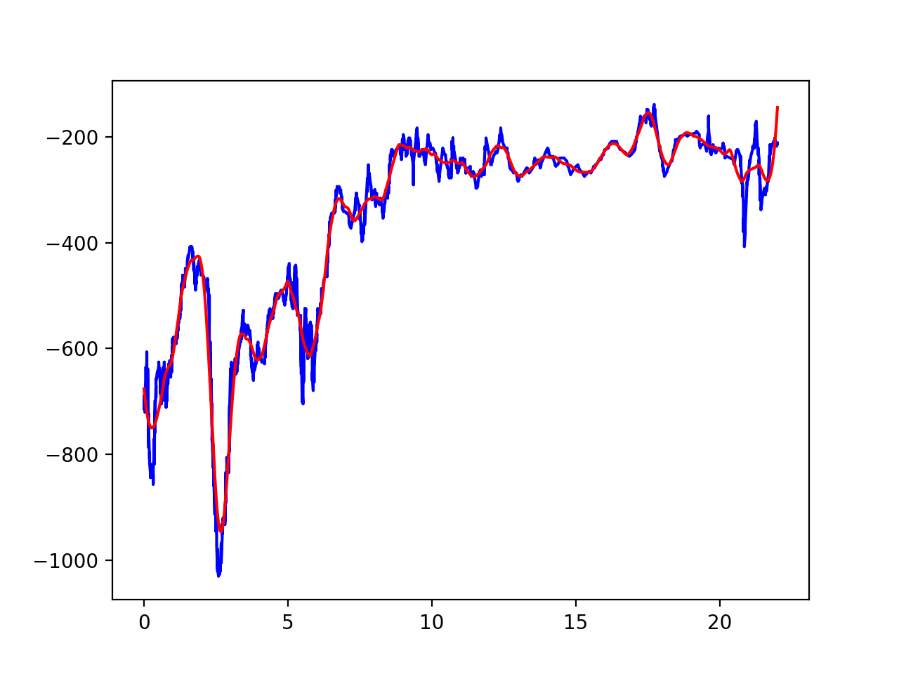

Northern Lights Forecast
========================

|PyPI| |Python Version| |License| |Read the Docs|

|Tests| |Codecov| |pre-commit| |Black|

.. |PyPI| image:: https://img.shields.io/pypi/v/northern-lights-forecast.svg
   :target: https://pypi.org/project/northern-lights-forecast/
   :alt: PyPI
.. |Python Version| image:: https://img.shields.io/pypi/pyversions/northern-lights-forecast
   :target: https://pypi.org/project/northern-lights-forecast
   :alt: Python Version
.. https://img.shields.io/pypi/l/northern-lights-forecast
.. |License| image:: https://img.shields.io/badge/license-MIT-blue
   :target: https://opensource.org/licenses/MIT
   :alt: License
.. |Read the Docs| image:: https://img.shields.io/readthedocs/northern-lights-forecast/stable.svg?label=Read%20the%20Docs
   :target: https://northern-lights-forecast.readthedocs.io/
   :alt: Read the documentation at https://northern-lights-forecast.readthedocs.io/
.. |Tests| image:: https://github.com/engeir/northern-lights-forecast/workflows/Tests/badge.svg
   :target: https://github.com/engeir/northern-lights-forecast/actions?workflow=Tests
   :alt: Tests
.. |Codecov| image:: https://codecov.io/gh/engeir/northern-lights-forecast/branch/main/graph/badge.svg
   :target: https://codecov.io/gh/engeir/northern-lights-forecast
   :alt: Codecov
.. |pre-commit| image:: https://img.shields.io/badge/pre--commit-enabled-brightgreen?logo=pre-commit&logoColor=white
   :target: https://github.com/pre-commit/pre-commit
   :alt: pre-commit
.. |Black| image:: https://img.shields.io/badge/code%20style-black-000000.svg
   :target: https://github.com/psf/black
   :alt: Black

Features
--------

Get notified whenever there are good chances of seeing northern lights! Follow
:code:`@NorthernLightsForecastBot` on telegram for updates on the Tromsø magnetometer, or
set up your own telegram bot with this project. Setting up a telegram bot is easy as pie,
just follow `this guide`_.

Requirements
------------

The project uses `tesseract` to read the scale off a magnetogram plot. See installation
instructions below.

Installation
------------

.. You can install *Northern Lights Forecast* via pip_ from PyPI_:

.. .. code:: console

..    $ pip install northern-lights-forecast

Clone the repository:

.. code:: console

    git clone https://github.com/engeir/northern-lights-forecast.git nlf && cd nlf

Install tesseract_, used with the package pytesseract.

Then get yourself a telegram bot using `this guide`_.

You might need to install :code:`opencv` manually. If you want to run the bot on for
example a raspberry pi, check out `this video`_ for installation of :code:`opencv`.

Set up a virtual environment and activate. (Use whatever, for example poetry:
:code:`poetry shell`.)

Now we are ready to install the project; run :code:`poetry install` in the root of the
project.

.. :code:`pillow` is a bit picky, and might have to be installed directly with
.. pip: :code:`pip install pillow`. And :code:`pip install scipy`, :code:`pip install
.. scikit-image`, :code:`pip install opencv-python`.

Set up a cron job:

.. code:: console

   sh crontab.sh

Running :code:`sh croptab.sh -p` will print to the console instead of installing a new
cron job.

Usage
-----

Please see the `Command-line Reference <Usage_>`_ for details. Below is the output of
:code:`nlf --help`:

.. code:: console

    Usage: nlf [OPTIONS]

      Northern Lights Forecast.

    Options:
      --version                     Show the version and exit.
      -l, --location TEXT           Which magnetometer to use. Run with '--
                                    locations' option to list all available
                                    locations.  [default: Tromsø]

      --locations / --no-locations  List out available magnetometer locations.
                                    [default: False]

      --test / --no-test            Test sending message to telegram.  [default:
                                    False]

      --help                        Show this message and exit.

Telegram
^^^^^^^^

It is also possible to visit the telegram bot (:code:`@NorthernLightsForecastBot`) and
query for forecasts live. This includes the commands:

* :code:`/start` and :code:`/help`: this will do the same thing, greet you with a helpful
  message
* :code:`/locations`: which will print out the valid locations a forecast can be obtained
  from
* :code:`Forecast <location>`: that is, any message that starts with the word
  :code:`forecast` and has a valid location as any of the succeeding words.

How?
----

The script implements an automated Northern Lights forecast by taking advantage of the web
site of `Tromsø Geophysical Observatory`_ (TGO).

Image analysis
^^^^^^^^^^^^^^

The script will try to download a :code:`.gif` file with plots of the components of a
magnetometer. One component is all that is needed (blue line) and the script will then
locate the blue pixels and fit a graph to the pixel locations with a `Savitzky-Golay
filter`_.

Below is an example with the original image above the new reverse engineered graph.

At a given threshold of the derivative of the X component of a magnetometer in Tromsø (or
one of the supported locations, see :code:`nlf --locations`), a notification is sent to a
telegram bot to let the user know of the current substorm event.

Cron
----

The script can be run every hour from 18:00 through 08:00 during the months September
through March, using cron to automate the task. Run

.. code:: console

    sh crontab.sh

to set this up, or edit the cron script manually with

.. code:: console

    env EDITOR=nano crontab -e

The general form of how you edit cron is as shown below, but to get the exact string you
can run :code:`sh crontab.sh -p`, where the option :code:`-p` will make the script print
to the console rather than edit cron. The same options can be used when running the script
as a cron job as is specified in the `Command-line Reference <Usage_>`_ (e.g.\ the
:code:`-l` option).

.. code:: console

    0 0-8,18-23 * 9-12,1-3 * export DISPLAY=:0 && cd /path/to/folder/containing/script && python src/northern_lights_forecast/__main__.py > t.txt 2>&1

To change when the script is run, edit the cron scheduling to a custom setting:
https://crontab.guru/

The :code:`crontab.sh` script will try to find the tesseract executable and add this to
path, which is needed for the cronjob to work.  If it cannot find tesseract, a comment is
instead printed warning about this, and you have to verify the installation of tesseract
and possibly add it to path manually.

Contributing
------------

Contributions are very welcome.
To learn more, see the `Contributor Guide`_.

License
-------

Distributed under the terms of the `MIT license`_,
*Northern Lights Forecast* is free and open source software.

Issues
------

If you encounter any problems,
please `file an issue`_ along with a detailed description.

Credits
-------

This project was generated from `@cjolowicz`_'s `Hypermodern Python Cookiecutter`_ template.

.. _@cjolowicz: https://github.com/cjolowicz
.. _Cookiecutter: https://github.com/audreyr/cookiecutter
.. _MIT license: https://opensource.org/licenses/MIT
.. _PyPI: https://pypi.org/
.. _Hypermodern Python Cookiecutter: https://github.com/cjolowicz/cookiecutter-hypermodern-python
.. _file an issue: https://github.com/engeir/northern-lights-forecast/issues
.. _pip: https://pip.pypa.io/
.. _tesseract: https://tesseract-ocr.github.io/tessdoc/Compiling-%E2%80%93-GitInstallation.html
.. _RealPython: https://realpython.com/python-send-email/#option-1-setting-up-a-gmail-account-for-development
.. _Tromsø Geophysical Observatory: https://www.tgo.uit.no/
.. _this guide: https://medium.com/@robertbracco1/how-to-write-a-telegram-bot-to-send-messages-with-python-bcdf45d0a580
.. _this video: https://www.youtube.com/watch?v=rdBTLOx0gi4
.. _Savitzky-Golay filter: https://docs.scipy.org/doc/scipy/reference/generated/scipy.signal.savgol_filter.html
.. github-only
.. _Contributor Guide: CONTRIBUTING.rst
.. _Usage: https://northern-lights-forecast.readthedocs.io/en/latest/usage.html
